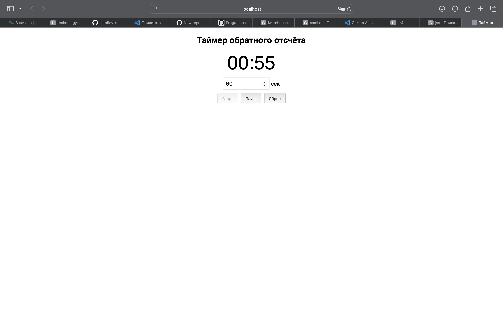
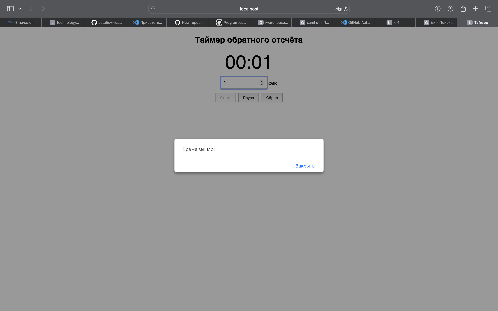

# Таймер обратного отсчёта

## Как пользоваться

- Введите количество секунд в поле ввода.
- Нажмите **Старт** — таймер начнёт обратный отсчёт.
- Кнопка **Пауза** остановит таймер.
- Кнопка **Сброс** сбросит таймер на 0.
- Когда время закончится, появится уведомление "Время вышло!".

## Скриншоты

**Главный экран:**  
На этом экране вы можете ввести количество секунд и запустить таймер.

**Таймер запущен:**  
Таймер отсчитывает время, кнопка "Старт" становится неактивной.

**Таймер завершён:**  
Когда время заканчивается, появляется уведомление "Время вышло!".

