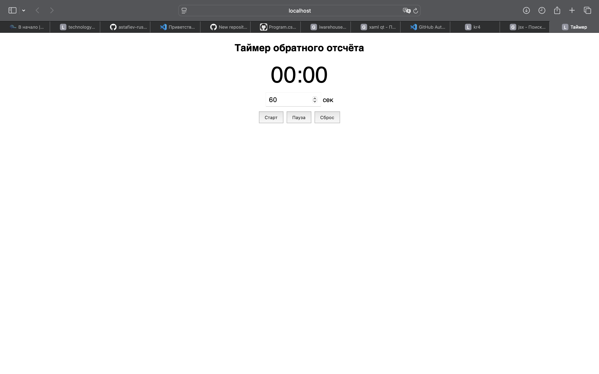
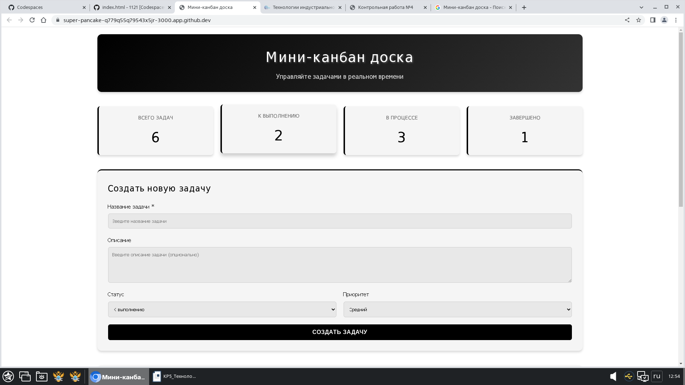
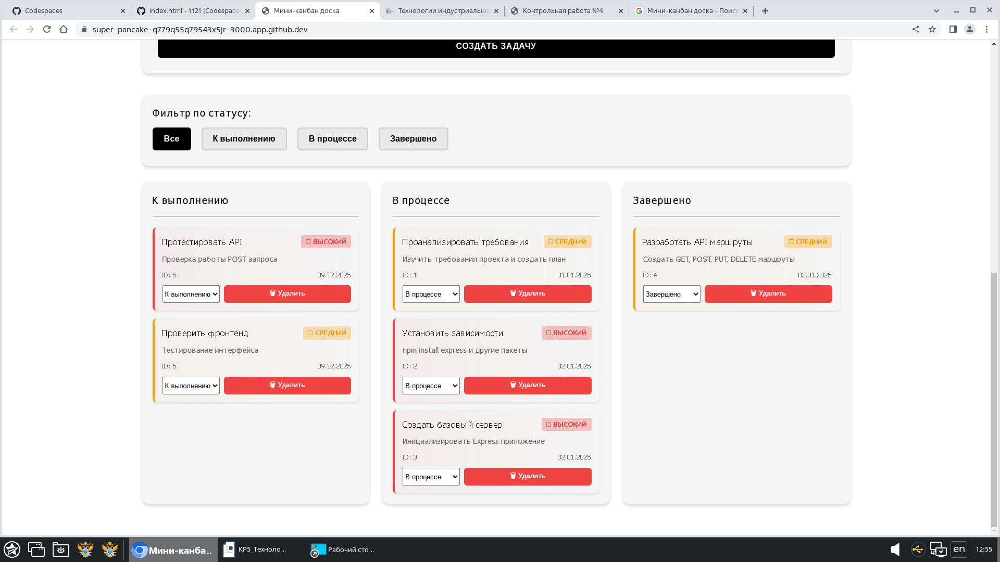

# Мини-канбан доска

## Основные функции

- Просмотр всех задач на канбан-доске
- Создание новых задач с описанием и приоритетом
- Изменение статуса задачи (К выполнению → В процессе → Завершено)
- Удаление задач
- Фильтрация по статусу
- Просмотр статистики доски
- REST API для взаимодействия с данными


### Маршруты (GET, POST, PUT, DELETE)
- **GET** `/api/tasks` — получить все задачи
- **GET** `/api/tasks/:id` — получить задачу по ID
- **GET** `/api/tasks/stats` — получить статистику доски
- **POST** `/api/tasks` — создать новую задачу
- **PUT** `/api/tasks/:id` — обновить задачу
- **DELETE** `/api/tasks/:id` — удалить задачу

### Работа с параметрами
- **req.params** — используется в маршрутах `GET /api/tasks/:id`, `PUT /api/tasks/:id`, `DELETE /api/tasks/:id`
- **req.query** — фильтрация по статусу: `GET /api/tasks?status=todo`

### Обработка тела запроса
- `express.json()` — обработка JSON данных в POST/PUT запросах
- `express.urlencoded()` — поддержка URL-encoded данных
- Валидация данных в контроллерах

### Собственный middleware
- Файл: `middleware/logging.js`
- Функция: логирование всех входящих запросов и ответов
- Показывает: метод, URL, статус код и время

### Раздача статических файлов
- `express.static('public')` в `server.js`
- Файлы в папке `public/`:
  - `index.html` — главная страница с интерфейсом
  - `styles.css` — стили приложения
  - `script.js` — JavaScript для взаимодействия с API

### Модульная архитектура
```
/workspaces/1121/
├── server.js                 # Главный файл приложения
├── package.json              # Зависимости и скрипты
├── README.md                 # Документация
├── routes/
│   └── tasks.js             # Определение маршрутов
├── controllers/
│   └── taskController.js    # Бизнес-логика обработки задач
├── middleware/
│   └── logging.js           # Собственный middleware для логирования
├── data/
│   └── tasks.js             # Управление данными (in-memory storage)
└── public/
    ├── index.html           # HTML интерфейс
    ├── styles.css           # CSS стили
    └── script.js            # JavaScript для фронтенда
```

## Технологический стек

- **Node.js** — среда выполнения JavaScript
- **Express.js** — веб-фреймворк для Node.js
- **HTML5** — разметка интерфейса
- **CSS3** — стили и дизайн
- **JavaScript (Vanilla)** — взаимодействие с API
- **JSON** — формат обмена данными


## Скриншоты

### Главная страница с канбан-доской


На этом скриншоте видны:
- Заголовок приложения "🎯 Мини-канбан доска"
- Карточки статистики (всего задач, к выполнению, в процессе, завершено)
- Форма для создания новой задачи
- Фильтры по статусу
- Три колонки доски: "К выполнению", "В процессе", "Завершено"
- Карточки задач с приоритетом и кнопками действий

### Форма создания задачи


На этом скриншоте видны:
- Поле ввода названия задачи
- Текстовое поле описания
- Выпадающие списки для выбора статуса и приоритета
- Кнопка создания задачи
- Пример заполненной формы

### Фильтрация по статусу


На этом скриншоте видна:
- Работа фильтров по статусам
- Активная кнопка фильтра подсвечена
- Доска отображает только задачи выбранного статуса
- Все колонки обновляются в соответствии с фильтром

## Структура файлов с описанием

```
server.js                    - Главный файл, инициализация Express
├─ express()                 - Создание приложения
├─ app.use(express.json())   - Middleware для JSON
├─ app.use(express.static()) - Раздача статики
├─ app.use(loggingMiddleware)- Собственный middleware
└─ app.listen(PORT)          - Запуск сервера

routes/tasks.js              - Определение всех маршрутов API
├─ GET /tasks               - Получить все задачи
├─ GET /tasks/:id           - Получить по ID (req.params)
├─ GET /tasks/stats         - Статистика
├─ POST /tasks              - Создать (express.json())
├─ PUT /tasks/:id           - Обновить (req.params + body)
└─ DELETE /tasks/:id        - Удалить (req.params)

controllers/taskController.js - Бизнес-логика
├─ getAllTasks()            - Обработка GET с query-фильтром
├─ getTaskById()            - Работа с req.params
├─ createTask()             - Обработка body и валидация
├─ updateTask()             - Валидация данных
├─ deleteTask()             - Удаление с проверкой
└─ getBoardStats()          - Расчет статистики

middleware/logging.js        - Собственный middleware
└─ loggingMiddleware()      - Логирование запросов/ответов

data/tasks.js               - Модуль управления данными
├─ getAllTasks()            - Получить все
├─ getTaskById(id)          - Получить по ID
├─ getTasksByStatus(status) - Фильтр по статусу
├─ createTask(data)         - Добавить новую
├─ updateTask(id, data)     - Изменить
├─ deleteTask(id)           - Удалить
└─ getBoardStats()          - Статистика

public/index.html           - HTML интерфейс
public/styles.css           - CSS стили (626 строк)
public/script.js            - JavaScript (390 строк)
```
